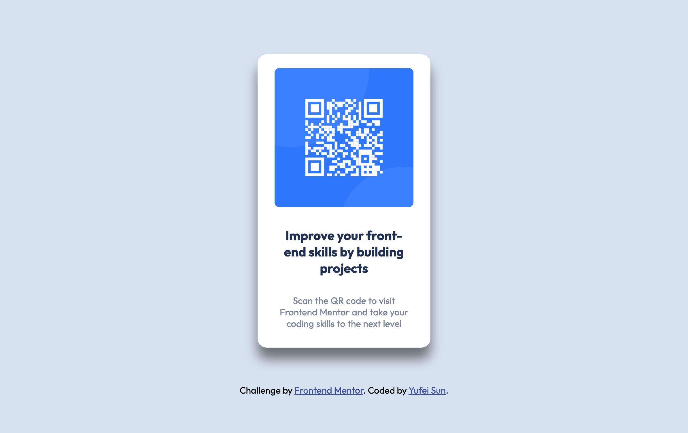

# Frontend Mentor - QR code component

- Solution for a challenge from(https://www.frontendmentor.io)

## About the project

Hi there! 🤗I'm Yufei, and this is my solution for a challenge created by Frontendmentor. Since I'm new to HTML and CSS, this project is a good opportunity to practise them. The main challenge of this project is to build out this QR code component and get it look as close to the design as possible. The users should be able to view the optimal layout depending on their device's screen size.

## Built with

- Semantic HTML5 Markup
- CSS custom properties
- Flexbox
- Desktop-first workflow

## What I learned

This is a simple project for someone who recently stepped in the world of development. I get familiar with the function and usage of flex container.

## Acknowledgements

Thanks to everyone who was willing to share their solutions, I learned a lot about how to improve my solutions. Also a big thank you to everyone who have gave me helpful suggestions so I can improve my solution!
